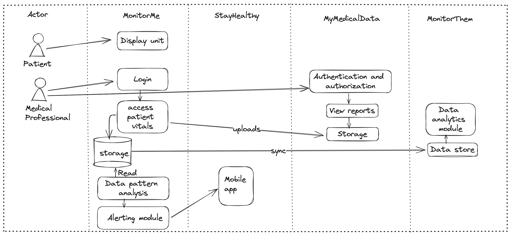

---
# Actors, Actions & Significant Scenarios

The Actors on the system (typically the human users but can also include other systems) and the actions they take help to form the key scenarios, or flows, of the system. The following identifies the significant actors, actions and key scenarios that will inform the architecture of the MonitorMe system

## Actors & Actions

The identified actors of Farmacy StayHealthy ecosystem and their actions are as follows:

| Actor                  | Actions                                                      |
| ---------------------- | ------------------------------------------------------------ |
| Patient | * Person whose vitals are continously monitored * |
| Medical professionals      | * Review vital history, generate reports by filetering them based on time, vital type etc.   Receive push notifications on their smartphone incase of emergencies   *|
| Medical Staff              | * Genereate holistic snapshots from  patient's consolidated vitals. Uploads the patient snapshot to MyMedicalData *|
| Nurse station              | * Consolidated monitoring screen displaying patient vitals refreshed every 5 seconds *|
| MonitorMe          | * On-premise monitoring appliction. * Monitor the vital signals received from patient. Send the vitals data to Nursing room * Alerts the on-call medical staff and Nursing room system if any issues are detected with patient. Sync data with MonitorThem system |
| StayHealthy mobile app     | * Mobile app used by medical staff to receive alerts on  patients from MonitorMe system during on-call *  |
| MonitorThem     | * comprehensive data analytics platform that is used for hospital trend and performance analytics  |
| MyMedicalData     | * Cloud-based patient medical records system used by doctors, nurses, and other heath professionals to record and track a patients heath records  |

## Architecturally Significant Scenarios

The following are the most architecturally significant scenarios/flows, derived from the Actors and Actions above, which will shape the architecture of the MonitorMe system

### 01  Send patiant vitals to MonitorMe system

Patients vitals are captured using 8 sensor devices and send to MonitorMe system

### 02 Monitor patient vitals, sync , analyse and alert medical professional for emergencies

Monitor patient vitals. Sync the data with MonitorThem cloud solution for analysing patient health, hospital response time on emergecy situations etc. Send monitorng data to Nursing station. Provide ability for medical professionals to genereate pateient reports and updload them to MyMedicalData cloud application

### 03 Nurse station receives patient vitals and alerts

Nursing station receive patient vitals from max 20 patients. Vitals are refreshed every 5 seconds with next patient data

------