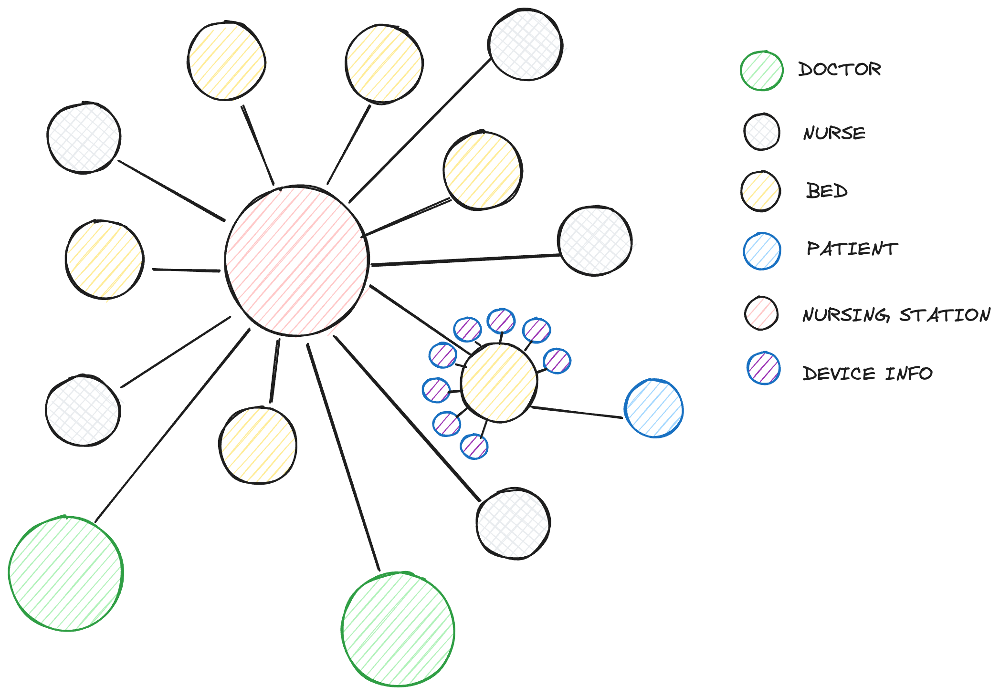

# Datastore Solution Overview

MonitorMe system required us to analyse and brainstorm data models to account for the following:
- general datastorage and retrieval (CRUD)
- Monitoring of highly frequent alerts required a time series data model
- potential mapping of several inter-connected entities

## Datastore Design Overview

### <u>Sensor Data</u>

- Sensor data from medical intruments are transmitted to the MonitorMe system. To keep a track of the changes in parameters or values overtime, a time series data model is best preferred that will not only help connect data before and after, but also provide means to run easy analysis to determine change.
- We intend to use the Influx DB to store the time series data model incoming into the system. Influx db ( a TimeSeriesDataBase ) provides the ability to set a retention policy to purge data after a said period of time ( in our case 24 hours which is the max data history to be persisted in the system )

 &nbsp;&nbsp;&nbsp;&nbsp;  

#### Sensor Data : Model

- Time Series data from all the 8 sensors will be stored in separate tables with timestamp as one unique key. All values will be tagged with the bed id and nurse station to accurately determine the patient it corresponds to and the doctors that correspond to the particular patient.
- Have independent tables for each device also allows independency in data reads and prevents complicated data.

### <u>Graph Structure for Data Mappings</u>

- A graph structure is preferred when data is intensly inter connected. Nursing stations, patients, doctors, nurses can be nodes that are interlinked.
- This will allow for easy querying of data and accurately connect different entities together.

