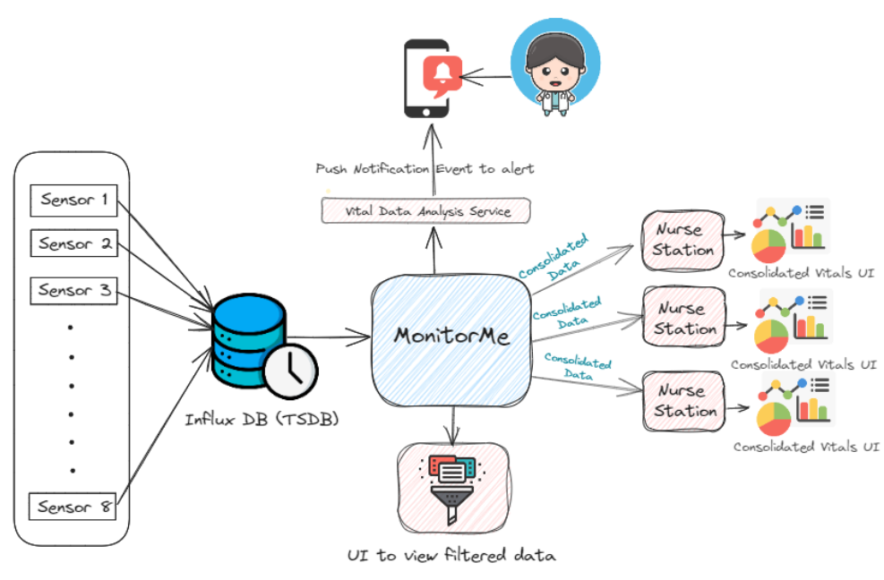

# High level architecture 

The below high level architecture shows the scope of the designed software system and indicate what external entities the system interacts with and it's behaviour. 

# Actors and actions 

Below is a high level interaction between actors

