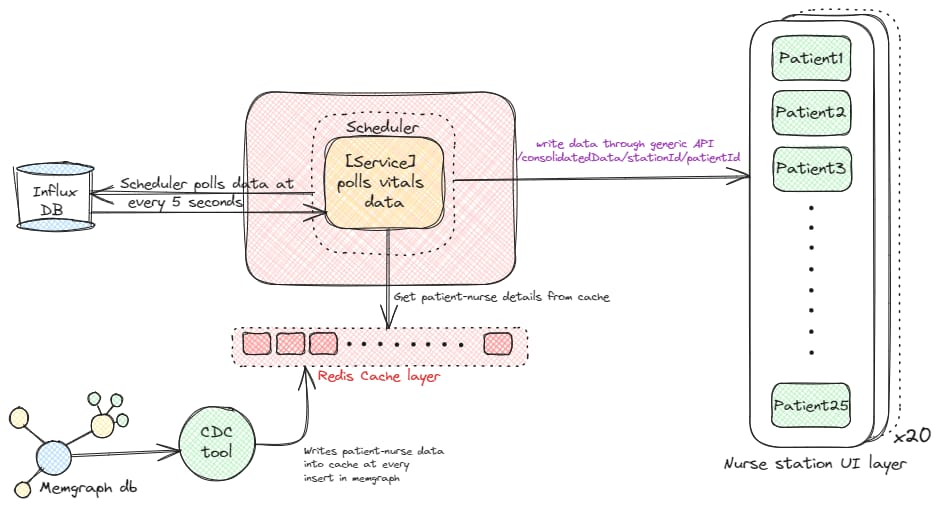

## Change Data Capture (CDC method)
Change Data Capture (CDC) is a method used in databases to track changes made to data. It captures and records changes such as inserts, updates, and deletes that occur in a database and makes them available for consumption by other systems or applications in real-time or near real-time.

The Graph database as explained in [Datastore](/2.%20Solution%20and%20Approach/DataStore.md) persists the patient and nurse data mappings. 
Whenever there is a change or insertion of a record in the database, the CDC tool identifies the update through its change detection mechanism and sends the data to the Redis cache for storage.

## Scheduler 
Each nurse station displays consolidated vitals data for each patient at an interval of 5 seconds. The scheduler sends a request to the Time Series Database (Influx DB) to fetch vitals data for the nth patient for all the 20 nurse stations. The consolidated data service pushes the consolidated data for each patient to the appropriate nurse station, as per the mapping retrieved from the Redis cache (previously populated from the graph database). Data is distributed to each nurse station using a generic api. Each nurse station has a web application hosted to display the consolidated data to the nurses.

