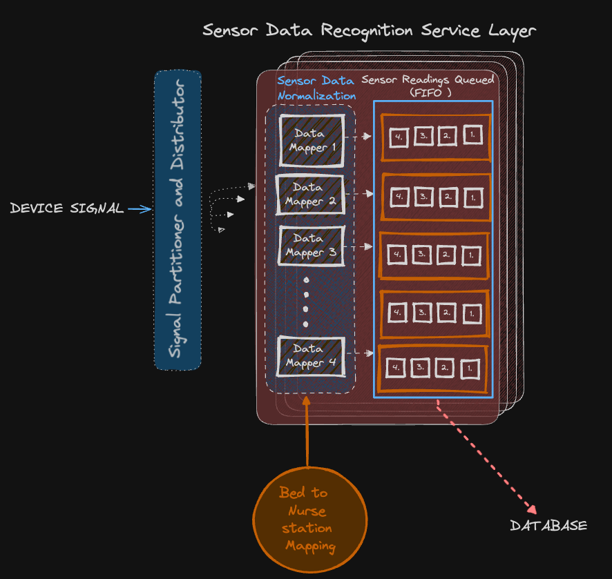

### Sensor Data Recognition Layer

At any given point of time, there may be a possibility that the server might receive deive data from any one of the 4000 devices available per MonitorMe System. It is critical to correctly tag the right nursing station to the signal and then write it to the db.

This is where the Sensor Data Recognition Layer comes in.

## Load Balancer / Data Partitioner and Distributor

Once the server receives a signal from a device, this layer is responsible to evenly distribute the incoming signals between the four nodes this Sensor Data Recognition Layer may be deployed on. This is to lower latency and preserve a fast response when we have several independent signals coming in.

## Data Mapper

Data Mapper forms the first point of contact of a signal object to the server. This mapper is responsible to take a signal data and correctly map it to the nursing station. It does so by looking up a the deviceId - Bed - Nursing Table lookup from the graph database (memgraph) persisted preferably on a readily availabe cache.

## Sensor Readings Queue ( Kafka )

- The second aspect of data recognition and write to the database involves a queue which stores the incoming data from the devices and streams them into the database. This helps streamline several calls from different devices into a structured queue ready to write into the database.
- Data Mappers continuously write to the Kafka queue as and when a signal comes into the server.

This following diagram captures the entire flow from sensor signal to the database.

