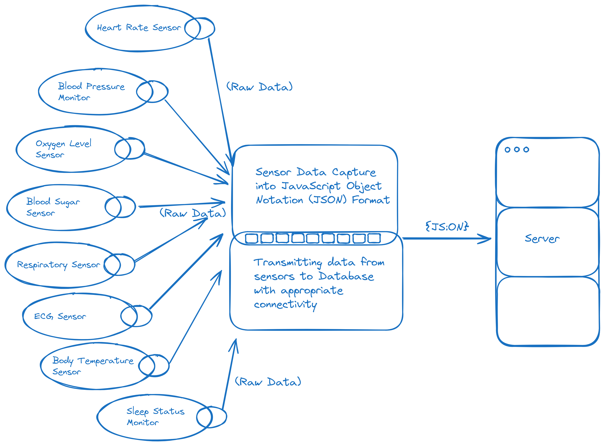

# Communication View

Data will have to be communicated from one endpoint to another. Data exchange takes place on a variety of places to ensure its judicious and up-to-date usage as desired.

Firstly, data comes in by means of the eight sensors available to measure Heart Rate every 0.5 seconds, Blood Pressure every 3600 seconds, Oxygen Level every 5 seconds, Blood Sugar every 120 seconds, Respiration every second, ECG every second, Body Temperature every 300 seconds and Sleep status every 120 seconds.
All this data shall get recorded by individual sensors on each bed and then be read from them through a device connected with them for the purpose of *accumulation* of data. The data will be accumulated into JavaScript Object Notation (JSON) format which provides a flexibility to store data on key-value pairs, which will classify the incoming data from sensors into their respective fixed keys and upload them over to the server for storage on its DataBase by means of an appropriate connectivity as maintained under the Internet of Things (IoT) cluster formed by these relevant devices. The data accumulator will be responsible to store and transmit the data from sensors into the server from where it shall be checked and become accessible across services for the further usage.

