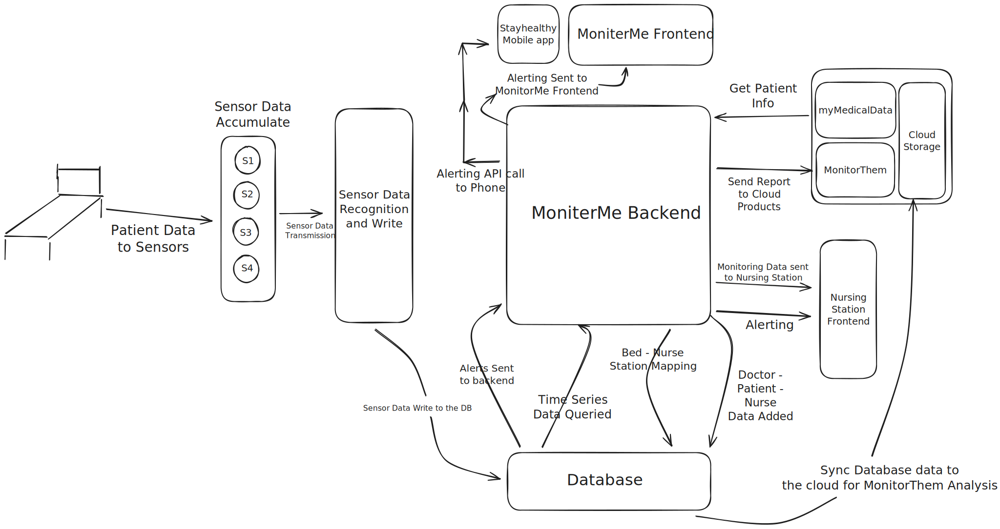

### Funtional View of MonitorMe Application

This view provides a good overview of the functionality of the overall system as seen by a business person. This ensures that we've captured all the major requirements. 

1. The flow starts from the left side of the image which illustrates the sensors from a bed transmitting the data.
2. The Mobile application, the monitorMe frontend application and the nursing station are all UI components for the end user to access and see data.
3. Each box in this system is a separate entity of it's own.

