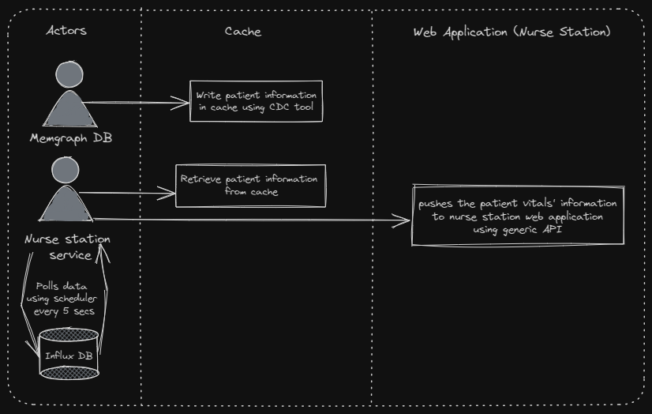

### Scenarios across the entire system that requires User Interaction

## 00. Alerting

1. The alerting scenario walks us through the flow of an alert notification to the user ( a doctor / nurse ) from the alerting module in the Influx DB. This scenario is critical to notify doctors of anomalies and abnormalities in patient health record.
&nbsp;
&nbsp;

## 01. Patient Health Record push to myMedicalData

1. This scenario attempts to explain the flow when a doctor or nurse want to push a snapshot of patient data to the StayHealthy Inc. cloud products, specifically the myMedicalData.
&nbsp;
&nbsp;

## 02. Nurse Station data refresh

1. In this scenario, Nurse station records updation is demonstrated in two phases. Firstly by writing patient information from Memgraph DataBase (DB) in Cache using Change Data Capture (CDC) tool, cache remains updated to provide quick access to the enquired data. Secondly, a Nurse station service keeps polling data with the help of a scheduler every 5 seconds to retrieve patient(s) information from DB cache and then pushes the vital information to nurse station applications through their API endpoints.

