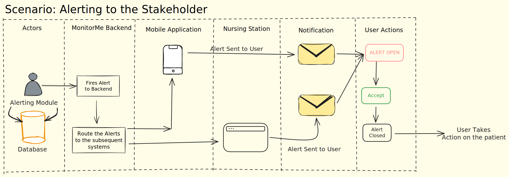
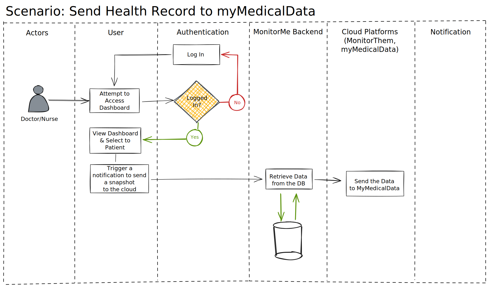
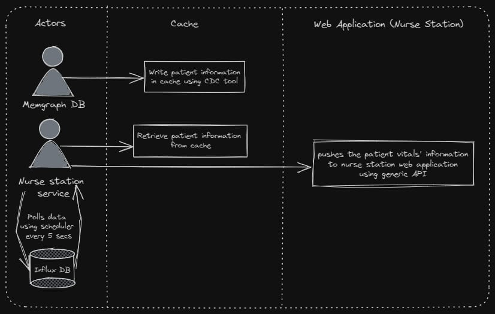

### Scenarios across the entire system that requires User Interaction

## 00. Alerting

1. The alerting scenario walks us through the flow of an alert notification to the user ( a doctor / nurse ) from the alerting module in the Influx DB. This scenario is critical to notify doctors of anomalies and abnormalities in patient health record.
&nbsp;
&nbsp;

## 01. Patient Health Record push to myMedicalData

1. This scenario attempts to explain the flow when a doctor or nurse want to push a snapshot of patient data to the StayHealthy Inc. cloud products, specifically the myMedicalData.
&nbsp;
&nbsp;

## 02. Consolidated Health Record Monitoring at Nurse Station

1. This scenario explains the flow of consolidated data of patient's vital records fetched from sensors to each nurse station.

